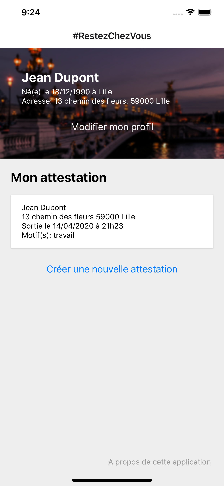
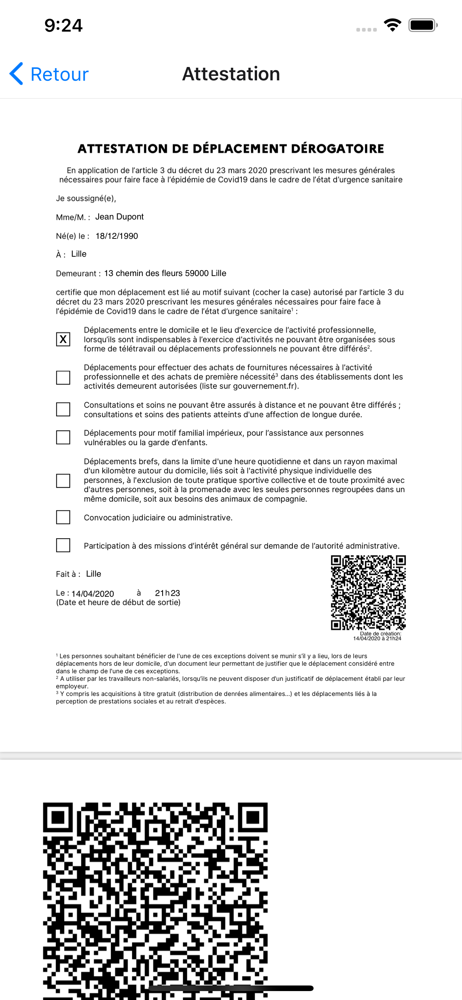
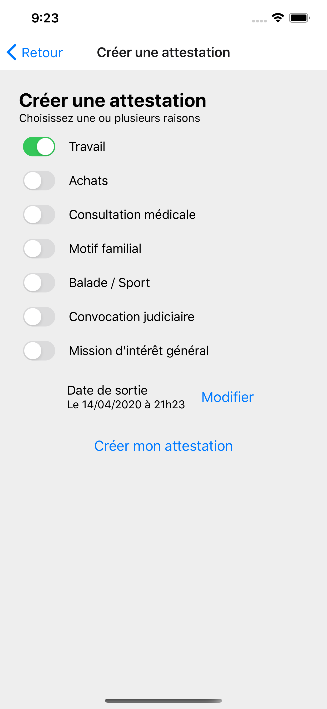

# #restezChezVous

> Générez et retrouvez facilement votre attestation de déplacement pendant le confinement !

## Introduction

L'application vous permet de :
- Générer rapidement votre attestation de déplacement
- Retrouver facilement votre attestation directement dans l'application
- L'attestation générée ainsi que son QR-Code sont conformes aux exigences du gouvernement (version en vigueur au 14/04/2020)

:rocket: Cette application est à jour pour le second confinement (Novembre 2020).

## Note

:-1: Cette application n'est malheureusement pas distribuée, Apple et Google refusant de publier toute application non officielle en rapport avec la Covid-19.\
:+1: Mais vous pouvez cloner le projet et la lancer en utilisant XCode (iOS) ou Android Studio (Android).

## Captures d'écran

Accueil             |  Attestation          |  Formulaire
:-------------------------:|:-------------------------:|:-------------------------:
  |   | 

